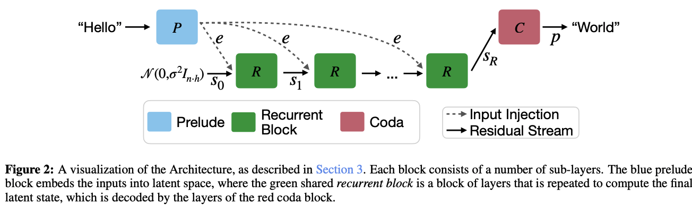

# llm-fav-resources

A curated list of favorite resources and readings related to LLMs.

## Talks

- [Language Modeling Workshop](https://docs.google.com/presentation/d/179dpzWSQ9G7EAUlvaJdeE0av9PLuk9Rl33nfhHSJ4xI/edit#slide=id.g30a4c7e9678_0_0)[Neurips 2024]
  A comprehensive guide to nooks and crannies of lanuage modeling, from dataset curation, transformation and filtering to anecdotal knolwedge about hyperparameters, scaling models efficiently in terms of compute, and predicting evals of large models from smaller models with the same compute. On top of that, an amazing overview of SOTA popular post-training techniques. Some technical aspects of the work (e.g. optimization) is discussed but there are better dedicated resources out there. This is more of a "Advice for Experiments and Common Pitfalls".

- [AI Engineering at Jane Street - John Crepezzi](https://www.youtube.com/watch?v=0ML7ZLMdcl4&pp=ygUXYWkgZW5naW5lZXIgamFuZSBzdHJlZXQ%3D) [AI Engineer 2025]
  How Jane Street LLM Team managed to collect, fine-tune, and verify LLMs for OCaml, given the fact that they have a bigger codebase in this language than most other online open source data, and how they managed to make the model and developer-friendly and task-oriented, while their datasets more amenable to reinforcement learning and verifiable rewards.

## Papers
- [Emergent Abilities of Large Language Models](https://arxiv.org/abs/2206.07682)
    Earliest work discussing the unpredictable emergent abilities of large language models on different tasks at scale.
- [Chain-of-Thought Prompting Elicits Reasoning in Large Language Models](https://arxiv.org/abs/2201.11903)
    One of the earliest work demonstrating first signs of reasoing through Chain-of-Thought prompting and intermediate generation of reasoning traces for a 540B-parameter model.
- [Mega: Moving Average Equipped Gated Attention](https://arxiv.org/pdf/2209.10655)
    Collection of interesting ideas combining gated networks with EMA representation of input sequences combined with single-head attention. A general case of S4 and Space-State Models. Shown competitive performance to the best transformer architectures at the time and S4. Dubious if this works for very long context or if it scales beyond ~500M params.
- [Efficient Streaming Language Models with Attention Sinks](https://doi.org/10.48550/arXiv.2309.17453)
- [ReLoRA: High-Rank Training Through
  Low-Rank Updates](https://arxiv.org/pdf/2307.05695) How to pre-train with LORA and re-merge LORA weights every once in a while and reset optimizer. Outperforms pure pre-training, fine-tuning with LORA, all the way up to 1.4B models in experiments. A good starter on low rank training.
- [The Surprising Effectiveness of
  Test-Time Training for Abstract Reasoning](https://ekinakyurek.github.io/papers/ttt.pdf) Using ideas from test-time training in Computer Vision, synthesize examples to exploit test-time compute to fine-tune the model. Tackles the Arc Challenge showing improvements over plain fine-tuned models.
- [Training Large Language Models to Reason in a
  Continuous Latent Space](https://arxiv.org/pdf/2412.06769)
  Training models to reason in latent space by taking last token embedding and feeding it back to the model without performing next word prection for a number of steps. Training is done by masking out output tokens one by one in each stage, instead allowing model to use latents and generate next latents freely.
- [Scaling LLM Test-Time Compute Optimally can be More Effective than Scaling Model Parameters](https://arxiv.org/abs/2408.03314)

- [Implicit Chain of Thought Reasoning via Knowledge Distillation](https://arxiv.org/abs/2311.01460)

- [Thinking Slow, Fast:
  Scaling Inference Compute with Distilled Reasoners](https://arxiv.org/pdf/2502.20339)

- [Self-Adapting Language Models](https://arxiv.org/pdf/2506.10943)
  Adapting Language models to few-shot examples or unknown knowledge in the context using test-time training. Instructing the model to produce self-edit recipes(generating recipes for SFT, summaries or notes from new knowledge, etc.). Self-edits are used to fine-tune the model and the downstream accuracy are used as reward to optimize the model towards effective self-edits. It uses Rest_EM on-policy RL. Shows improvements over in-context learning.

- [Learning without training: The implicit dynamics of in-context learning](https://arxiv.org/pdf/2507.16003)
  In-context learning from token prompts can be reduced to a weight update on the first linear layer after the contextual block(attention, rnn, etc.) which is dependent of contextual output with and without the context: $A(x) - A(C,x)$:

$T_W(C, x)=T_{W+\Delta W(Y)}(C \backslash Y, x) \quad \text { where } \Delta W(Y)=\frac{(W \Delta A(Y)) A(C \backslash Y, x)^T}{\|A(C \backslash Y, x)\|^2}$

> Where $ \Delta A(Y ) = A(C, x) − A(C\backslash Y, x) $ is the context vector associated to $Y$. Note that $\Delta W(Y)$ is rank 1 since $W \Delta A(Y) $ is a column vector and $A(C\backslash Y,x)^T$ is a row vector.

- [Reasoning with Sampling: Your Base Model is Smarter Than You Think](https://www.arxiv.org/pdf/2510.14901)
  Reason using a Monte Carlo Markvo Chain extension of the power distribution of model log likelihood $p^a$ where heavier parts of the likelihood accrue more density by exponentiating the likelihood, leading to high probable regions being explored more than low confidence regions. Performance on par with RL for test-time compute and surpasses RL on reasoning for other tasks and on par with pass@k of base model on high $k$s, alleviating mode collapse and avoiding narrowing of exploration space.

- [Continual Learning via Sparse Memory Finetuning](https://arxiv.org/pdf/2510.15103)

- [Native Sparse Attention: Hardware-Aligned and Natively Trainable Sparse Attention](https://arxiv.org/abs/2502.11089)
  Triton [implementation](https://github.com/Noumena-Network/NSA-Test) by @xjtr

- [Titans: Learning to memorize at Test Time](https://arxiv.org/abs/2501.00663)
- [Less is More: Recursive Reasoning with Tiny Networks](https://arxiv.org/pdf/2510.04871): An improvement to Hierarchial Reasoning models using a simplified 2-layer approach for recursive reasoning.
- [ReAct: synergizing reasoning and acting in language models](https://arxiv.org/abs/2210.03629) One of the first papers demonstrating the loop of reasoning and acting(tool calling etc.) in LLMS shown to be effective when interleaved.
- [How much do language models memorize?
](https://arxiv.org/pdf/2505.24832) [ICML 2026] Information-theoric analysis of how much language models memorize, stated through the combination of intented memorization(generalization) and unintended memorization. Experimented through llms trained on random text data(0 and 1s) and actual text. Great experiments + beautiful formulation using previous definitions in the literature of information theory. A must read.

### Recurrence(?)
**Dedicating a section to literature studying recurrence depth-wise either in inference or training.**

-[Scaling up Test-Time Compute with Latent Reasoning:
A Recurrent Depth Approach](https://arxiv.org/pdf/2502.05171)
Scaling test-time recurrence through depth with full experiments all the way to 3.5 billion parameters and 800 billion tokens. Interesting observations.
<p align="center">
    </img>
</p>

## Tutorials

- [Build a Large Language Model (From Scratch)](https://github.com/rasbt/LLMs-from-scratch)
- [nanogpt](https://github.com/karpathy/nanoGPT) Purely Python small gpt implementation by Andrej Karpathy
- [How to Scale Your Model: A Systems View of LLMs on TPUs](https://jax-ml.github.io/scaling-book/)

## Quantization

- [Group-wise Precision Tuning Quantization (GPTQ)](https://arxiv.org/abs/2210.17323)
- [Activation-Aware Layer Quantization (AWQ) ](https://arxiv.org/abs/2306.00978)
- [Half-Quadratic Quantization](https://mobiusml.github.io/hqq_blog/)
- [A Gentle Introduction to 8-bit Matrix Multiplication for transformers](https://huggingface.co/blog/hf-bitsandbytes-integration) by Tim Dettmers. A great introduction on how general weight quantization works across formats(bf16, int8, int16, etc.), importance of outlier features, scaling and usage with `accelerate` library

## Miscellaneous

- [Attention is off by one](https://www.evanmiller.org/attention-is-off-by-one.html)
  Must read on why sink attention is getting popular + source of many attention weight outliers

- [70b model training infrastructure](https://imbue.com/research/70b-infrastructure/) A startup company, Imbue, published this wonderful blog on their journey to set up an infrastructure of 4088 H100 GPUs to train a 70B model. Topics include network connections, GPU logs, diagnosis of errors and issues and variosu health check procedures.
- [Huggingface face Ultra-Scale Training Playbook](https://huggingface.co/spaces/nanotron/ultrascale-playbook) An interactive in-depth overview of different components of language models, nature of computation carried out, memory usage and paralleization technique following best training practices and a high-level illustration of techniques used in popular GPU kernels. A priceless blog for beginners to the performance and engineering aspects of training.
- [Can Large Language Models Explain Their Internal Mechanisms?](https://pair.withgoogle.com/explorables/patchscopes/) A blog post, with accompanying research paper, on patching hidden representation of tokens dynamically in-place to study the behavior of LLMS, specifically the extent of context capture from earlier to later layers in transformers.

- [You could have designed state of the art positional encoding](https://huggingface.co/blog/designing-positional-encoding) A simple intuitive examination of positional encodings, why they were devised and how we ended up with Rotatary Positional Encodings.

- [KV-cahing in nanoVLM ](https://huggingface.co/blog/kv-cache) A brief huggingface dive into how decoding would be performed by caching Key and Values in all attention blocks of a Vision-Language Model. With code example of decode and prefilling phase.

- [On N-dimensional Rotary Positional Embeddings](https://jerryxio.ng/posts/nd-rope/) Visualization of ROPE with different parameters, and the extension to two or more dimensions + Vit experiments.

- [The Big LLM Architecture Comparison](https://magazine.sebastianraschka.com/p/the-big-llm-architecture-comparison)
  In depth comparison of archiectural difference of models (open source, open architecture) at various scales. Differences from MOE, transformer only, activation functions, normalization layers, Attention mechanism used, etc.

- [Defeating Nondeterminism in LLM Inference](https://thinkingmachines.ai/blog/defeating-nondeterminism-in-llm-inference/) A quest to answer why batched requests to LLM APIs, or even local provider backends(vllm, sglang) provide non-deterministic results when running with different batch sizes. The answer lies in the nondeterministic order of reduction within RMSNorm, Matmul and attention kernels to accomodate undersaturated GPUs. This beautiful, yet simple, example, is a simple demonstration why batch invariance is important.

```python
import torch
torch.set_default_device('cuda')

B = 2048
D = 4096
a = torch.linspace(-1000, 1000, B*D).reshape(B, D)
b = torch.linspace(-1000, 1000, D*D).reshape(D, D)
# Doing a matrix vector multiplication by taking
# the first element of the batch
out1 = torch.mm(a[:1], b)
# Doing a matrix matrix multiplication and then taking
# the first element of the batch
out2 = torch.mm(a, b)[:1]
print((out1 - out2).abs().max()) # tensor(1669.2500, device='cuda:0')
```

- [LORA Without Regret](https://thinkingmachines.ai/blog/lora/) Batch size effect, best learning rates, layers where Lora should be applied, and lots of other practical notes for fine-tuning LLMs.

- [Contiunal Learning by Jessy Lin](https://jessylin.com/2025/10/20/continual-learning/) Great high level overview of how continual learning can be approached through the lens of generalization from unstructured new data and intergration(choosting what to forget or keep from) old data.

- [Continuous batching by Huggingface](https://huggingface.co/blog/continuous_batching) Explains how KV caching, chunked prefilling, and dynamic rescheduling of batches enables backends such as vLLM or sgLang to serve LLMs at very high throughput.

- [Faster-Transformers](https://huggingface.co/blog/faster-transformers)
  High-level overview of innovations used in the LLM and transformer spaces to serve large models on one or a couple of GPUs with lower memory requirements and better latencies across batched queries. This blog is tailored to GPT-OSS models and reviews many additions to the HF family such as pre-compiled kernels library, MXFP4 quantization, and experimental continuous batching support along with standard tensor and expert parallel for inference.

- [How LLMs Scaled from 512 to 2M Context: A Technical Deep Dive
](https://amaarora.github.io/posts/2025-09-21-rope-context-extension.html)
A journey through absolute PE to RoPE, to why extrapolation fails, linear interpolation and NTK-based methods all the way to the industry standard YaRN.

- [Quantization from the ground up
](https://ngrok.com/blog/quantization)

- [LLM Inference Economics From First Principles](https://www.tensoreconomics.com/p/llm-inference-economics-from-first)
A great write-up with full mathematical calculation clarity on the economics of serving a Llama3.3 model. Calculation of exact model parameters, total number of floating point operations, and analysis of throughput and cost while increasing sequence length and batch size. Best available resource for the economics of these models.

- [Using group theory to explore the space of positional encodings for attention](https://blog.janestreet.com/using-group-theory-to-explore-positional-encodings-attention/)
A beautiful look at positional encodings from Jane Street through the lens of group theory. Shows the design space of positional encodings for a sequence with desirable causal and logical properties are limited to certain choices, deriving NoPE and RoPE along the way.

- [Fourier Feature Encoding](https://sair.synerise.com/fourier-feature-encoding/)
A detour from LLM-related material, but shows the nice connection of sinusodial positional embeddings to fourier embedding features which provide controllable beneficial high-frequency information when encoding numerics(integer or real features, positions, etc.). It shows connections to ALIBI for extrapolating pos encodings to longer sequnces as well.

- [Writing A Megakernel For LLM Decode - A Worklog
](https://emre570.bearblog.dev/megakernel-decode/) An amazing tale through trials of megakernel implementation for decode at M=1. So many great lessons about profiling, and optimizing what is actually the bottleneck for the right setting(here decoding token by token for one query) not the elegant strategy that has the better flair.

- [Scaling Laws, Carefully](https://lilianweng.github.io/posts/2026-06-24-scaling-laws)
A detailed blog on the intricacices of scaling laws. A great primer on how to approach the problem of measuring scaling parameters, fitting curves, and the various dimensions the problem statement can be constructed in(data repitition is the most surprising by far imo)

- [Sparse Linear Attention](https://www.haoyizhu.site/blog/sparse-linear-attention/)
(Need to be translated to English) A nice explanation and derivation of linear attention, and the works around sparse linear attention from first order approximation of the softmax function. Beautifully builds up the blocks to the recent Gated Delta Attention(in Kimi-Linear or Kimi K3) illustrating how they induce sparsity enforced from previous work(e.g. Native Sparse Attention) into the linear formulation. Great blog if you want to know everything in linear attention variants mathematically, and how all of them can be derived from one another, their drawbacks and strengths.

- [How speculative decoding makes LLMs go brrr](https://leoniemonigatti.com/blog/speculative-decoding.html)
A short blog fully outlining speculative decoding and probability chains of draft/target model, how it speeds up inference, and recent work in the literature for faster and more accurate draft responses.

